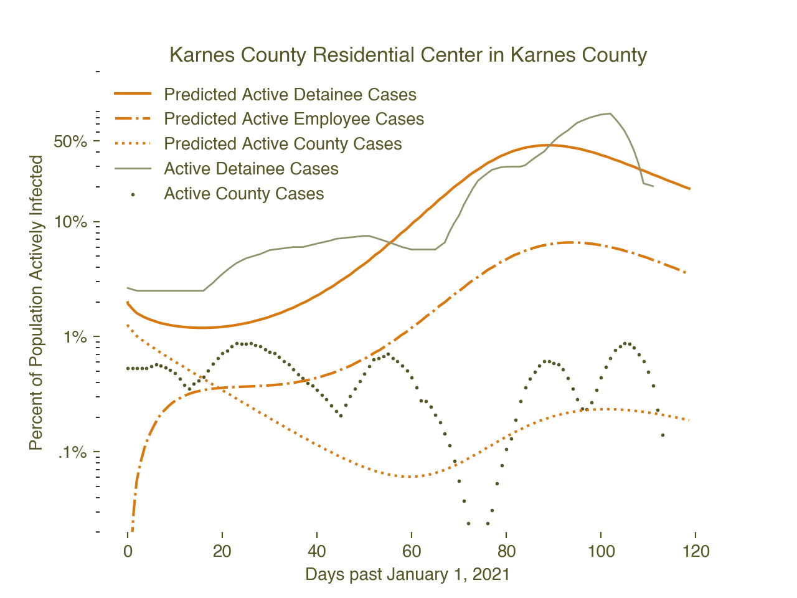

# covid-spread-ICE-SEIR

This codebase is used for a mathematical disease spread model of COVID-19 community spread between ICE detention 
centers and surrounding counties or communities. See  `LICENSE` for usage.

The primary usage of this codebase is as a part of the [UCLA Law COVID-19 Behind Bars Data Project](https://uclacovidbehindbars.org/).

This SEIR model is known as a **deterministic, mean-field, compartmental disease model** in which a population can be
modeled via compartments depending on their current disease state: S (susceptible), E (exposed),
I (infectious), R (recovered or removed). Although there are many other types of disease models,
the deterministic, compartmental, mean-field model here is one of the primary simple methods.

For more detail, technical documentation for this model can be found [here](https://drive.google.com/file/d/1vp4A8Oag6QttV0w91-TZbsMiOpp238Dz/view?usp=sharing). 

The file `analysis.py` contains example usage for running the model and plotting with real data, including
a snippet used for the plots in the relevent article (link TBD). 

The SEIR model code can be found in `model.seir_model`. 

Sample figure of the model fit to real county and detention data, plotted with a 
prediction of employee case rates:

